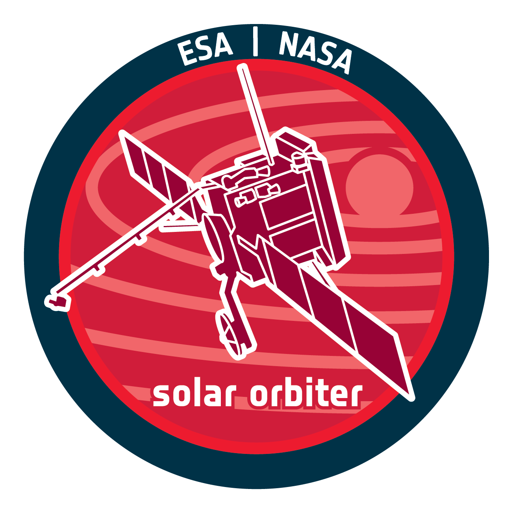

# **SO/PHI-HRT PIPELINE**

Reduction software for SO/PHI-HRT instrument on the ESA Solar Orbiter

 


  <br>


## **PHI-HRT data reduction**
1. read in science data (+scaling) (one or multiple files)
2. read in flat field (+scaling) - accepts only one flat field fits file
3. read in dark field (+scaling)
4. prefilter correction
5. apply dark field (to only science - assumes flat is dark fielded)
6. clean flat field with unsharp masking (Stokes QUV, UV or V)
7. normalise flat field
8. apply flat field
9. apply field stop
10. apply hot pixels mask
11. polarimetric registration
12. demodulate with const demod matrix <br>
        a) option to output demod to fits file <br>
13. normalise to quiet sun
14. calibration <br>
        a) ItoQUV cross talk correction <br>
        b) VtoQU cross talk correction <br>
15. wavelengths registration
16. rte inversion with cmilos <br>
        a) output rte data products to fits files <br>


## **Setup**

Operating System: Linux

##############################################################

If running on bob MPS server (and you have access)
### Run bash script: `setup.sh` to skip the first 5 steps
##############################################################


Otherwise:

1. Compile milos in both cmilos-fits folder and cmilos folder (cmilos-fits):

```bash
make clear
make
```

2. P-MILOS - multiple steps required - assumes running on **BOB** server
- module load openmpi_gcc
- module load fftw
- load cfitsio (or export through .bashrc)

```bash
make clean
make
```    
3. Setup virtual environment from requirements.txt with PIP or CONDA

using pip - REQUIRES PYTHON >= 3.6
```bash
pip install -r requirements.txt
```
OR using conda (Anaconda3) - creates virtual environment called 'hrt_pipeline_env'
```bash
conda env create -f environment.yml
```

4. Activate 'hrt_pipeline_env'
```bash
source activate hrt_pipeline_env
```

5. Install sophi_hrt_pipe package
```bash
pip install -e .
```
##############################################################
### OPTIONAL - load Jupyter Notebook `hrt_pipeline_notebook.ipynb` which contains all the following steps

(once environment loaded and activated - need the environment to start and use all the steps in the notebook)

First let jupyter notebook know the environment exists:

```
python -m ipykernel install --user --name hrt_pipeline_env
```
Then start the notebook <br>

##############################################################

\*\***(DEPRECATED)**\*\* 5. Download files - see **Download Input Files** Section 

6. Generate json files with the science, dark and flat you desire to reduce, ensure that all keywords from in the example are used (for limb images you must know the limb in the FOV - can only reduce multiple limb files at the same runtime if all the same limb in FOV)

7. Make sure the correct input.json file is given to `hrt_pipe` in ```run.py```

8. Execute ```run.py```

```bash
python run.py
```

## **Configuration**

Any and all steps can be turned on or off as you wish using the keywords in the input json file passed to the `phihrt_pipe` function

See `/input_jsons/create_input_json.py` for example to create json file

## **Download Input Files** \*\***(DEPRECATED)**\*\*

\*\* In input.json file, cant insert directly .fits.gz files from the PHI database \*\*

This needs the 'dataproc' environment - see **Setup**

EITHER: download from the PHI Image Database (recommended): https://www2.mps.mpg.de/services/proton/phi/imgdb/

Suggested filters for HRT science data: 
- **Keyword Detector = 'HRT'** <br >
- **Filename\* like \*L1_phi-hrt-ilam_date\***
        
To download via the command line (eg: if you want to save the files on a server and not locally)
```
wget --user yourusername --password yourpassword file_web_address
gunzip file.gz
```
Gunzip used to unpack the .gz to the file you want  <br>

Can also use `/download/download_from_db.py` to perform multi download from database:

Instructions:
  1. From the database find the files you wish to download
  2. Copy the 'Download File List' that the database will generate
  3. Paste into the `file_names.txt` file
  4. Create a `.env` file with your MPS Windows login: <br> 
      ```text=
      USER_NAME =
      PHIDATAPASSWORD =
      ```  
  5. Set the target download folder in the `download_from_db.py` file
  6. Run the file (will require dotenv python module to be installed - included in `hrt_pipeline_env`) 

OR : use `download_files.py` to download images from the attic repository: https://www2.mps.mpg.de/services/proton/phi/fm/attic/
## **Output**

#### **Stokes File**
Filename: `solo_L2_phi-hrt-stokes.....fits.gz`

Shape: [Y,X,POL,WAVE]
#### **RTE products**

- File: `solo_L2_phi-hrt-bmag.....fits.gz`

  Shape: [Y,X] <br>
  |B| (Gauss) </p>

- File: `solo_L2_phi-hrt-binc.....fits.gz`

  Shape: [Y,X] <br>
  Inclination (Degrees) </p>

- File: `solo_L2_phi-hrt-bazi.....fits.gz`

  Shape: [Y,X] <br>
  Aimuth (Degrees) </p>

- File: `solo_L2_phi-hrt-blos.....fits.gz`

  Shape: [Y,X] <br>
  Blos (Gauss) </p>

- File: `solo_L2_phi-hrt-vlos.....fits.gz`

  Shape: [Y,X] <br>
  Vlos (km/s) </p>

- File: `solo_L2_phi-hrt-icnt.....fits.gz`

  Shape: [Y,X] <br>
  Continuum Intensity

- File: `_rte_data_products.fits`

Shape: [6,Y,X] <br>
First Index:
- 0: Continuum Intensity
- 1: Magnetic Field Strength |B| (Gauss)
- 2: Inclination (degrees)
- 3: Azimuth (degrees)
- 4: Vlos (km/s)
- 5: Blos (Gauss) </p>

#### **Intermediate/Auxilliary Files**

- File: `_dark_corrected.fits.gz`

  Shape: [Y,X] <br>
  Dark corrected science data

- File: `_flat_corrected.fits.gz`

  Shape: [Y,X] <br>
  Flat corrected science data

- File: `copy_{flat_field_name}.fits.gz`

  Shape: [Y,X] <br>
  Flat field before US

- File: `_prefilter_corrected.fits.gz`

  Shape: [Y,X] <br>
  Prefilter corrected science data

- File: `_demodulated.fits.gz`

  Shape: [Y,X] <br>
  Demodulated science data
 
***


### **Authors**: <br>

Jonas Sinjan - Max Planck Institute for Solar System Research, Goettingen, Germany

### **Contributors**: <br>

Daniele Calchetti - Max Planck Institute for Solar System Research, Goettingen, Germany

Fatima Kahil - Max Planck Institute for Solar System Research, Goettingen, Germany

### **Credit**: <br>

- SPGPylibs for the foundation, from which it was expanded upon
- CMILOS: RTE INVERSION C code for SO-PHI (based on the IDL code MILOS by D. Orozco) Author: juanp (IAA-CSIC)
- CMILOS-FITS: CMILOS with fits interace, fits interfacing developed by Philipp Loeschl (MPS)
- P-MILOS:  Parallellised RTE INVERSION C code Authors: Manuel Cabrera, Juan P. Cobos, Luis Bellot Rubio (IAA-CSIC)
- PyPD for the PSF deconvolution algorithm, by F. Kahil (MPS)